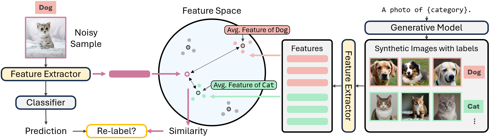

# Noisy Label Refinement with Semantically Reliable Synthetic Images (ICIP 2025)
This repository includes all codes to reproduce the main experiments of our paper: **Noisy Label Refinement with Semantically Reliable Synthetic Images** | [Paper](https://arxiv.org/abs/2509.04298) | [Poster](assets/ICIP2025_poster.pdf)



### Overview
Semantic noise in image classification datasets, where visually similar categories are frequently mislabeled, poses a significant challenge to conventional supervised learning. In this work, we leverage synthetic images generated by advanced text-to-image models as reliable reference points to identify and correct mislabeled samples.  
Rather than using synthetic images directly for training, our method exploits their semantic consistency to refine noisy datasets, enabling robust model training under challenging noise conditions. Since the approach operates as a preprocessing step, it is orthogonal to existing noise-robust learning techniques and can be seamlessly integrated with them.  
Extensive experiments on CIFAR-10, CIFAR-100, and ImageNet-100 demonstrate that our approach significantly improves classification accuracy under various noise scenarios.  

Our contributions are summarized as follows:  
- **Validation of synthetic images**: We validate the effectiveness of synthetic images for noisy label learning, providing valuable insights for future research.  
- **Orthogonal integration**: Our method can be directly combined with other noisy label learning approaches, establishing state-of-the-art performance across multiple benchmarks.  

This README mainly consists of two parts:  
- **Codes**: Brief explanations of the main files and functions.  
- **How to run**: Instructions on how to reproduce the experiments.  


# Codes
- `resnet_train.py`: Train an initial model using noisy labels.  
- `resnet_finetune.py`: Main script.  
  - Choose either the method from `img_filter_sim.py` or `img_filter_clip.py` for denoising.  
  - Optional: Add `--add_generated` in the command to replace removed images with generated images of the same class.    
  - After denoising, compute the noise rate and fine-tune the classifier on the refined dataset.  
- `img_filter_sim.py`: Module for denoising with generated images.  
  - `filter_images_iter0`: For each class, remove a specified number of images based on similarity with generated images. If `--add_generated` is specified, the removed images will be replaced with the same number of generated images of that class.  
  - `relabel_and_copy_images`: Do not remove images, but instead re-assign them with new labels.  
  - `random_discard_images`: Randomly remove a specified number of images from each class (used for ablation studies).  
- `img_filter_clip.py`: Same algorithms as in `img_filter_sim.py`, but using CLIP as the feature extractor.  


# How to run
## Prerequisites
- Install required packages:
  ```
  pip install -r requirements.txt
  ```
- Download the CIFAR datasets and place them under `data/`:
  ```
  wget https://www.cs.toronto.edu/~kriz/cifar-10-python.tar.gz -P data/
  wget https://www.cs.toronto.edu/~kriz/cifar-100-python.tar.gz -P data/
  tar -xvzf data/cifar-10-python.tar.gz -C data/
  tar -xvzf data/cifar-100-python.tar.gz -C data/
  ```
- Download the noisy labels (provided as `.npy` files by [LRA-diffusion](https://github.com/puar-playground/LRA-diffusion/tree/main/noise_label)) and place them under `data/noise_label/`.
- Convert CIFAR data into PNG format with noisy labels and save them into class-based subfolders:
  ```
  python data/cifar2png.py
  ```
    

## Training & Fine-tuning
- Train a baseline classifier on noisy CIFAR data:
  ```
  bash resnet_train.sh
  ```
- Refine noisy labels with generated images and fine-tune the classifier:
  ```
  bash resnet_finetune.sh
  ```


# Citation
If you find this research helpful, please consider citing our paper:
```
@inproceedings{li2025noisy,
  title={Noisy Label Refinement with Semantically Reliable Synthetic Images},
  author={Li, Yingxuan and Mao, Jiafeng and Matsui, Yusuke},
  booktitle={Proceedings of the IEEE International Conference on Image Processing},
  year={2025}
}
```